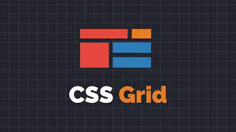

<h1 align="center">
  
</h1>

<div align="center">
  <a href="#-estudo">Estudo</a>&nbsp;&nbsp;&nbsp;|&nbsp;&nbsp;&nbsp;
  <a href="#-tecnologias">Tecnologias</a>&nbsp;&nbsp;&nbsp;|&nbsp;&nbsp;&nbsp;
  <a href="#-licença">Licença</a>&nbsp;&nbsp;&nbsp;|&nbsp;&nbsp;&nbsp;
  <a href="#-autor">Autor</a>
</div>

<br> 

<p align="center">
  
  
  
</p>

<br>

## 💻 Estudo

Este estudo consiste em pequenos exemplos de como aplicar CSS Grid em projetos. Foi Desenvolvidas durante as aulas na plataforma de ensino B7Web com o professor Bonieky Lacerda.
<br>


## 🚀 Tecnologias

Este estudo foi desenvolvido com as seguintes tecnologias e ferramentas:

- [HTML5](https://developer.mozilla.org/pt-BR/docs/Web/HTML)
- [CSS Grid](hhttps://www.w3schools.com/css/css_grid.asp)
- [VS Code](https://code.visualstudio.com/)

<br>

## 🔥 Executar Aplicações

### 🎇 Executando Localmente as Aplicações

Caso você deseja executar os pequenos exemplos de CSS Grid em sua máquina local,  basta seguir os passos abaixo:

### 🌀 Começando...

Para começar, você deve simplesmente clonar o repositório do projeto na sua máquina.

### ❗️ Após clonar (via Windows):

Abra o cmd (caso esteja utilizando o Windows) navegue até o local onde você clonou o projeto, exemplo:

```sh
C:\Users\NomeDoComputador\Documents\CloneDoProjeto
```

Quando encontrar a pasta de estudo `css-grid`, dentro desta estará os pequenos exemplos de estudo organizados por número.
<br>

### 🛰️ Executando os exemplos de estudo CSS Grid

Bom, agora que acessou a pasta `css-grid`, você poderá abrir cada exemplo e executar o arquivo index.html de cada projetinho com a extensão do VSCode Liver Server.

Pronto! dessa forma o projeto `css-grid` estará rodando localmente em sua máquina.

## 🚩 Tenho Dúvidas... O que fazer?

Caso tenha dúvidas sobre o código do projeto, sintam-se a vontade em abrir uma **[ISSUE AQUI](https://github.com/Wanderson-A-Timoteo/css-grid/issues)**. Assim que possível, responderei todas as dúvidas!

<br>

## 💡 Licença

Esse projeto está sob a licença MIT. Veja o arquivo [LICENSE](github/LICENSE.md) para mais detalhes.

<br>

## 🎆 Autor

Feito com ♥ by

-  [**Wanderson A. Timóteo**](https://www.wandersontimoteo.ga/)

<br>

## 🤝 Agradecimentos


<div align="center">
  

<br>

Estudo realizado e desenvolvido durante as aulas na plataforna de ensino [B7WEB](https://b7web.com.br/fullstack/?ref=K40921767Y&msclkid=19c576ee8ce315d5acd514754d2e3dc6).

Com o professor [Bonieky Lacerda](https://www.instagram.com/bonieky/).
